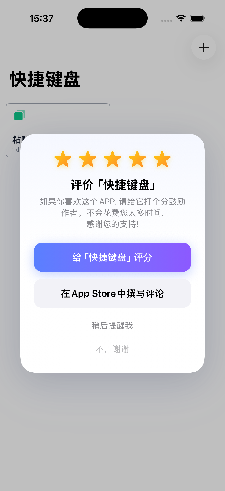

<p align="right">
  <a href="README.md">English</a> · <a href="README_zh.md">简体中文</a> · <a href="README_ja.md">日本語</a> · <a href="README_ko.md">한국어</a>
</p>

# iOS-Evaluate

[](https://www.swift.org)
[](https://developer.apple.com)
[](LICENSE)
[](https://swift.org/package-manager/)

iOS 26+ 를 위한 현대적이고 아름다운 앱 리뷰 요청 라이브러리. **SwiftUI 그라디언트 디자인**, **Swift 6 동시성**, **30개 이상 언어 현지화**를 지원합니다.

<br/>

<p align="center">
  
</p>

<br/>

## ✨ 주요 특징

| 기능 | 설명 |
|---|---|
| 🎨 **그라디언트 UI** | 선명한 그라디언트 버튼, 애니메이션 골드 별 아이콘, 햅틱 피드백 |
| 🎯 **스마트 트리거** | 설치 일수, 앱 실행 횟수, 주요 이벤트 기반 자동 표시 |
| 🔄 **SwiftUI + UIKit** | 네이티브 `.evaluateReviewPrompt()` 수정자 및 `UIViewController` 지원 |
| 🌍 **30개 이상 언어** | 아프리칸스어부터 베트남어까지 완전한 현지화 |
| ⚡ **Swift 6 지원** | `@MainActor`, `Sendable`, `async/await` 전면 적용 |
| 📳 **햅틱 피드백** | 버튼 인터랙션 시 섬세한 촉각 반응 제공 |

<br/>

## 📦 설치

### Swift Package Manager

1. Xcode에서 **File → Add Package Dependencies...** 선택
2. 저장소 URL 입력:
   ```
   https://github.com/zhanggenlove/iOS-Evaluate.git
   ```
3. 버전 규칙을 선택하고 타겟에 추가.

<br/>

## 🛠 사용법

### 초기 설정 (AppDelegate / App init)

```swift
import Evaluate

// 트리거 규칙 설정
Evaluate.daysUntilAlertWillBeShown = 5
Evaluate.appUsesUntilAlertWillBeShown = 10
Evaluate.significantUsesUntilAlertWillBeShown = 3
Evaluate.numberOfDaysBeforeRemindingAfterCancelation = 7

// 추적 시작
Evaluate.start()
```

### SwiftUI — 네이티브 수정자

```swift
import SwiftUI
import Evaluate

struct ContentView: View {
  @State private var showReview = false

  var body: some View {
    Button("작업 완료") {
      if Evaluate.isRateDone == false {
        showReview = true
      }
    }
    .evaluateReviewPrompt(isPresented: $showReview)
  }
}
```

### UIKit — 한 줄로 완료

```swift
import Evaluate

class MyViewController: UIViewController {
  func taskCompleted() {
    Evaluate.rateApp(in: self)
  }
}
```

<br/>

## 🎨 테마 커스터마이징

`EvaluateTheme`으로 리뷰 카드 외관을 커스터마이징:

```swift
Evaluate.theme = EvaluateTheme(
  starColors:       [.yellow, .orange],
  primaryGradient:  [.blue, .purple],
  secondaryGradient:[.gray.opacity(0.1), .gray.opacity(0.15)],
  cornerRadius:     28
)
```

<br/>

## 🧪 디버그 모드

개발 중 모든 트리거 조건을 우회:

```swift
Evaluate.activateDebugMode = true
```

> ⚠️ App Store에 출시하기 전에 반드시 비활성화하세요.

<br/>

## 🌐 현지화

iOS-Evaluate는 **30개 이상의 언어** 번역을 내장:

English、简体中文、繁體中文、日本語、한국어、Français、Deutsch、Español、Português、Italiano、Русский、العربية、हिन्दी、Tiếng Việt 외 다수.

라이브러리는 시스템 언어를 자동으로 감지합니다. 추가 설정이 필요하지 않습니다.

<br/>

## 📋 요구 사항

| 요구 사항 | 버전 |
|---|---|
| iOS | 26.0+ |
| Swift | 6.2+ |
| Xcode | 26+ |

<br/>

## 📄 라이선스

iOS-Evaluate는 [MIT 라이선스](LICENSE) 하에 배포됩니다.
